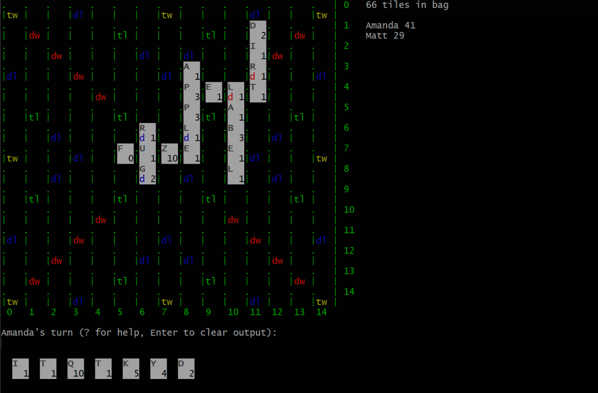

# scrubble

[](https://godoc.org/github.com/mandykoh/scrubble)
[](https://goreportcard.com/report/github.com/mandykoh/scrubble)
[](https://travis-ci.org/mandykoh/scrubble)

`scrubble` is a Go library for modelling a letter/word board game.

Key features include:

  * Complete and flexible game logic implementation, including support for tournament-style player initiated challenges or automatic word validation.
  * Solitaire (single player) support in case you want to practice alone.
  * Detailed error handling—To support rich UIs.
  * Replayable games—Turn history is automatically tracked, and all random number generation is externalised in case you want to use deterministic random sequences (eg for replays).
  * Customisable board layouts—Want weirdly long rectangular boards with multiple start positions and score multipliers everywhere? You got it.
  * Customisable tile sets—Why limit yourself to the English alphabet? You know you always wanted to play with emoji phrases.
  * Customisable tile bags—Just specify the distribution of tiles you’d like.
  * Customisable dictionaries (the public domain ENABLE word list is included by default).
  * Extensible rules—The rules for how tile placement is validated, how words are formed and scored, when word validation is done, when the game ends, etc can be extended or completely replaced.

See the [API documentation](https://godoc.org/github.com/mandykoh/scrubble) for more information.

This software is made available under an [MIT license](LICENSE).


## Getting started

This library uses [dep](https://github.com/golang/dep) for dependency management. After cloning/downloading, first update the dependencies:

```
$ dep ensure
```


## Demo

As a demonstration of how it might be used, this library includes `textscrubble`, a simple terminal-based game for one or more players that can be played on one computer.



From the project location, `textscrubble` can be run as follows:

```
$ go run cmd/textscrubble.go [mode] [player1_name] ... [playerN_name]
```

`mode` can either be `simple` (where words are automatically validated and only valid words may be played) or `challenge` (where any words can be played but players may challenge a play to have it validated, at the risk of a penalty).


## Running tests

Tests can be run like any Go project:

```
$ go test
```


## Example usage

### Setting up a game

A Game first needs to be created and started to begin play. At minimum, a [Bag](https://godoc.org/github.com/mandykoh/scrubble#Bag) of tiles and a [Board](https://godoc.org/github.com/mandykoh/scrubble#Board) must be provided:

```go
bag := scrubble.BagWithStandardEnglishTiles()
board := scrubble.BoardWithStandardLayout()
game := scrubble.NewGame(bag, board)
```

The above can also be written more concisely as:

```go
game := scrubble.NewGameWithDefaults()
```

Once a game is created, it is in the Setup phase, and players can be added. `scrubble` doesn’t model players directly, preferring to let different usages model them as appropriate for the usage. Instead, we have [Seats](https://godoc.org/github.com/mandykoh/scrubble#Seat), which represent a player’s presence at a game (and all things relevant to that, such as the score and the rack of tiles). We can add seats as follows:

```go
seat, err := game.AddPlayer()
```

When some players have been added to the game, the game can be started, which begins the Main game phase:

```go
var rng *rand.Rand
...
err := game.Start(rng)
```

All game operations which use randomness take a random number generator. This allows you to control the random generation as appropriate for your use case.


### Custom boards

Apart from using the standard board layout provided by [`BoardWithStandardLayout`](https://godoc.org/github.com/mandykoh/scrubble#BoardWithStandardLayout), custom board layouts are supported. A custom layout can be easily created as follows:

```go
__, st, dl, dw, tl, tw := scrubble.BoardPositionTypes()

board := scrubble.BoardWithLayout(scrubble.BoardLayout{
    {tw, __, __, dl, __, __, __, tw, __, __, __, dl, __, __, tw},
    {__, dw, __, __, __, tl, __, __, __, tl, __, __, __, dw, __},
    {__, __, dw, __, __, __, dl, __, dl, __, __, __, dw, __, __},
    {dl, __, __, dw, __, __, __, dl, __, __, __, dw, __, __, dl},
    {__, __, __, __, dw, __, __, __, __, __, dw, __, __, __, __},
    {__, tl, __, __, __, tl, __, __, __, tl, __, __, __, tl, __},
    {__, __, dl, __, __, __, dl, __, dl, __, __, __, dl, __, __},
    {tw, __, __, dl, __, __, __, st, __, __, __, dl, __, __, tw},
    {__, __, dl, __, __, __, dl, __, dl, __, __, __, dl, __, __},
    {__, tl, __, __, __, tl, __, __, __, tl, __, __, __, tl, __},
    {__, __, __, __, dw, __, __, __, __, __, dw, __, __, __, __},
    {dl, __, __, dw, __, __, __, dl, __, __, __, dw, __, __, dl},
    {__, __, dw, __, __, __, dl, __, dl, __, __, __, dw, __, __},
    {__, dw, __, __, __, tl, __, __, __, tl, __, __, __, dw, __},
    {tw, __, __, dl, __, __, __, tw, __, __, __, dl, __, __, tw},
})
```

with `__`, `st`, `dl`, `dw`, `tl`, and `tw` representing positions where regular, starting, double-letter score bonuses, double-word score bonuses, triple-letter score bonuses, and triple-word score bonuses should appear, respectively.


### Custom tile bags

Bags can also be created with tiles different to those provided by [`BagWithStandardEnglishTiles`](https://godoc.org/github.com/mandykoh/scrubble#BagWithStandardEnglishTiles) by specifying what tiles and how many of each tile a bag should contain:

```go
// Creates a Bag with 9 x A tiles, 2 x B tiles, 2 x C tiles, 4 x D tiles, and
// 1 x 😃 tile (that happens to be worth 50 points)
bag := scrubble.BagWithDistribution(scrubble.TileDistribution{
    {scrubble.Tile{'A', 1}, 9},
    {scrubble.Tile{'B', 3}, 2},
    {scrubble.Tile{'C', 3}, 2},
    {scrubble.Tile{'D', 2}, 4},
    {scrubble.Tile{'😃', 50}, 1},
})
```

If a tile is given a point value of zero, it is treated as a wildcard tile (a tile which may have its letter substituted for any other letter at the time of play).


### Playing a turn

Once started, a game begins at a random player’s turn, and proceeds around to each player in sequence. The current player can be determined from the game itself:

```go
seat := game.CurrentSeat()          // Points to seat of player whose turn it is
seatIndex := game.CurrentSeatIndex  // Allows indexing game.Seats to the current seat
```

The current player may play some tiles from their rack, exchange any tiles on their rack with the bag, or pass.

Tiles can be played as follows:

```go
playedWords, err := game.Play(scrubble.TilePlacements{
	{scrubble.Tile{'B', 3}, scrubble.Coord{5, 6}},
	{scrubble.Tile{'G', 2}, scrubble.Coord{5, 8}},
})
```

If there was a tile with the letter 'A' at coordinate 5,7 this play would form the word 'BAG'. The game verifies that the tiles being played are indeed available from the current player’s rack, and that they are being placed in legal positions.

Tiles with different point values are treated as different tiles, with the exception of zero-point tiles:
those are treated as wildcards, which can take on any letter when played. To play a wildcard, specify a tile of any letter but with a zero point value:

```go
playedWords, err := game.Play(scrubble.TilePlacements{
	{scrubble.Tile{'B', 3}, scrubble.Coord{5, 6}},
	{scrubble.Tile{'G', 0}, scrubble.Coord{5, 8}},
})
```

If the current player does indeed have a wildcard tile on their rack, the game will interpret this as playing it with a letter of 'G'.

The words formed by the play, their positions on the board, and their individual scores are returned as a slice of [`PlayedWord`](https://godoc.org/github.com/mandykoh/scrubble#PlayedWord)s, so that any UI can display them, highlight them, etc:

```go
firstWordAsString := playedWords[0].Word
scoreOfFirstWord := playedWords[0].Score
boardCoordinateRangeOfFirstWord := playedWords[0].CoordRange
```

A player may also exchange any tiles from their rack with random tiles from the bag:

```go
err := game.ExchangeTiles([]scrubble.Tile{
	{'B', 3},
	{'G', 2},
}, rng)
```

Here, if the player possesses a 'B' and a 'G' tile, they will be removed from the player’s rack and replaced with two other tiles from the bag.

And finally, a player may simply pass, forfeiting their turn to the next player:

```go
err := game.Pass()
```

After each turn, the player’s rack is replenished from the bag and their total score is updated. These can be determined from the player’s seat:

```go
totalScore := seat.Score
tilesInRack := seat.Rack
```

### Ending a game

After each turn, according to the game rules in play, the game may end. This can be determined from the game’s current phase:

```go
hasGameEnded := game.Phase == scrubble.EndPhase
```

When the game ends, scoring is finalised and no further turn actions may be made.


### Challenges

Games can be run either using player-initiated challenges (the default) or automatic word validation. This is controlled via the `Rules`:

```go
game.Rules = game.Rules.WithDictionaryForScoring(trueOrFalse)
```

When `WithDictionaryForScoring` is set to true, all words formed on every play are automatically validated against the current dictionary, and only valid words are allowed to be played.

When set to false, any words may be played and it is up to players to initiate a challenge (via [`Game.Challenge`](https://godoc.org/github.com/mandykoh/scrubble#Game.Challenge)) if they believe some words formed may be illegal, at which point words from the last play will then be validated against the dictionary:

```go
err := game.Challenge(challengerSeatNum, rng)
```

A challenge can be made immediately after any successful play, and only affects that play. A play may only be challenged once. If the challenge succeeds, the last play is withdrawn and the challenged player effectively loses their turn. Otherwise, the challenger suffers a score penalty.

If the last, game-ending play of a game can be challenged, it is possible for a challenge to cause the game phase to return from `EndPhase` back to `MainPhase` and thus being in play again. Once such a challenge is attempted, whether successful or not, the game is well and truly over.


### Custom rules

Each game has a [`Rules`](https://godoc.org/github.com/mandykoh/scrubble#Rules) struct that it uses to run the core logic of the game, like how to determine what words were formed and how to score those words. This can be overridden to extend or completely replace game rules:

```go
game.Rules = game.Rules.
	WithChallengeValidator(overridingChallengeValidator).
	WithDictionary(overridingDictionary).
	WithGamePhaseController(overridingGamePhaseController).
	WithPlacementValidator(overridingPlacementValidator).
	WithRackValidator(overridingRackValidator).
	WithWordScorer(overridingWordScorer)
```


### Game history and replays

Each turn and challenge for a game is recorded in its [`History`](https://godoc.org/github.com/mandykoh/scrubble#History). All operations requiring a random number generator accept one as a parameter. When the game is run consistently with a deterministic random number generator (such as a seeded pseudorandom generator), the history makes it possible to track (and backtrack) and replay games.
